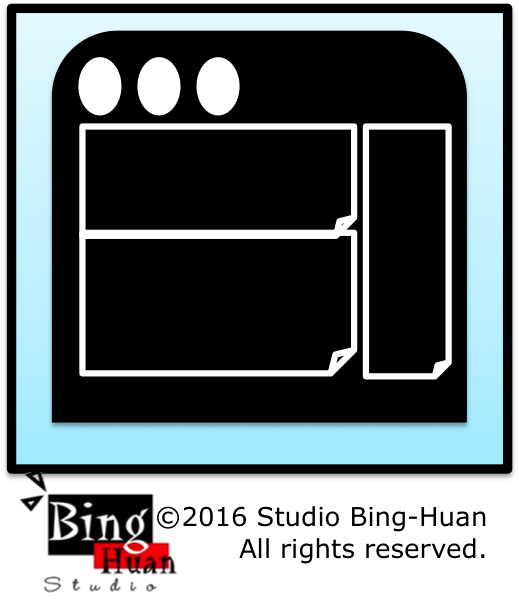

=======
# BrowserExt_BH_TabFinder

## Project: tab Finder.

My blog: <a href="http://studiobinghuan.blogspot.tw/2016/03/tab-finder-browser-extension.html?view=flipcard">http://studiobinghuan.blogspot.tw/2016/03/tab-finder-browser-extension.html?view=flipcard</a> 

### How to setup project
#### Install all nodejs packages locally.
npm install

#### Build project
webpack
